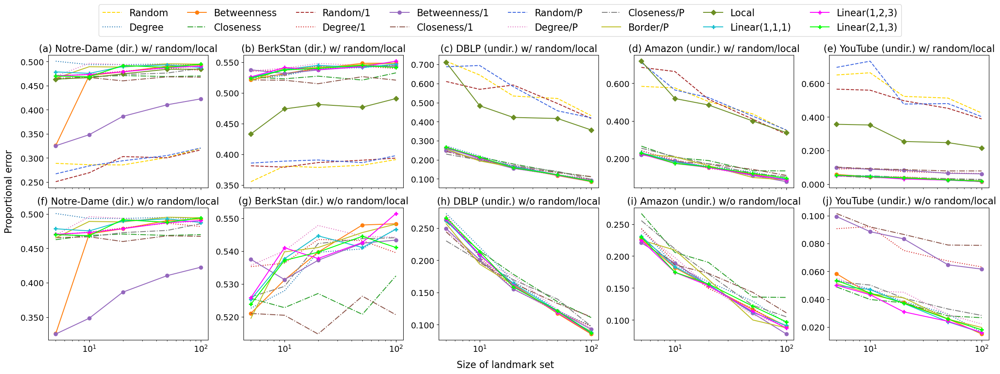

# Fast Shortest Path Distance Estimation
## By Santiago García Mayayo & Niels Heslenfeld

This GitHub repository contains Python code for estimating shortest path distances using landmarks. This project was our final project for the course Social Network Analysis for Computer Scientists at Leiden University taught by Dr. F.W. Takes.

The project builds upon the work by Potamias et al<a id="1">[1]</a> by adding some new landmark selection strategies. We added a strategy based on Betweenness centrality, one that constructs a linear combination of Degree, Closeness centrality and Betweenness centrality, and a newly proposed centrality measure. These strategies are mostly based on those used in the original paper and strategies proposed/used by other researchers in this area. Most of our proposed methods turned out to perform quite well (see figure below).



Using these strategies to select a "good" set of landmarks, we aim to approximate the shortest path distances in the graph as well as possible. Approximation is necessary as for very large graphs (>1M nodes), the exact computation becomes too expensive.

The required packages (and their used version) that are not part of the standard library are:
- igraph (0.10.8)
- numpy (1.21.5)
- pandas (1.3.5)
- matplotlib (3.5.2)
- metis (0.2a5)

We have no indications that slightly older/newer versions might break the program but the requirements.txt file is defaulted to these versions. So either the requirements.txt file can be used to install these packages or one can simply run:

```
> pip install igraph numpy pandas matplotlib metis
```

After that, make sure that all the paths of the environment are set correctly so that the required packages can be found and make sure that the datasets (edge lists of graphs) are in the datasets/ folder. The folder is empty due to git not accepting large files so feel free to add your own datasets. However, do make sure to then also add the names of the dataset files (in tsv format and with .tsv extension) in the DATASETS list in function init() in code/settings.py so that the correct datasets will be used. If you are using datasets with directed networks, also make sure to change the if-statement on line 59 in function main() in main.py to detect these directed datasets. Results will automatically be visualized in a plot which will be stored in the results/ folder.

### References
<a id="1">[1]</a>
M. Potamias, F. Bonchi, C. Castillo, and A. Gionis (2009). 
Fast shortest path distance estimation in large networks. 
Proceedings of the 18th ACM Conference on Information and Knowledge Management (CIKM), 867-876.
